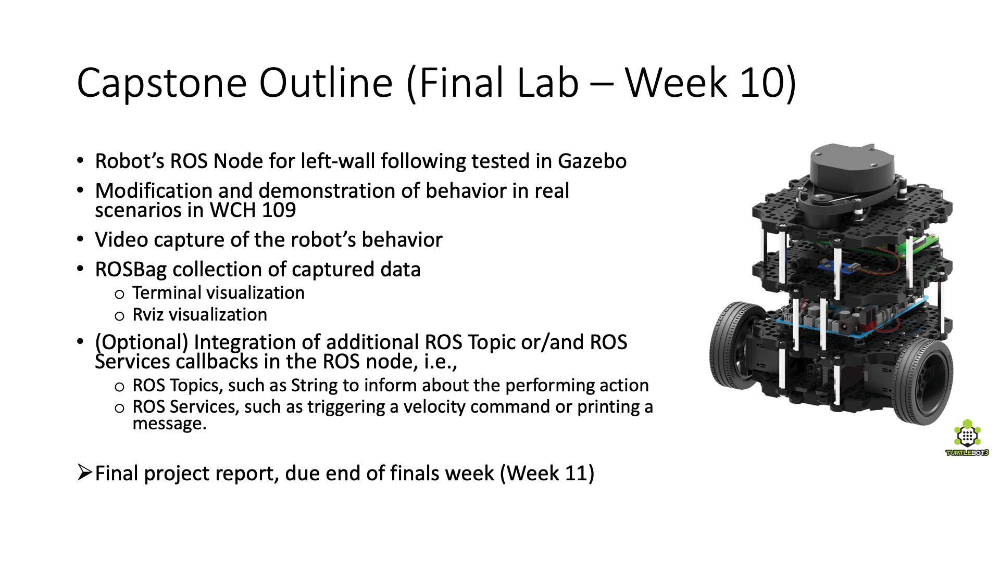

Lab 8: Go! Turtlebot!
=====================

Overview
--------

In this lab, we will put everything together and apply what we have learned so far in ROS on the real Turtlebot3 Burger. 
The task is to use Turtlebot3 and perform left-wall following in a real-world environment without colliding with obstacles or walls and finally kicking the ball at the endpoint of the map.

The implemented ROS node of `Lab 7 <https://ucr-ee106.readthedocs.io/en/latest/lab7.html#>`_ will be used with proper modifications, to run onboard the Turtlebot3 to complete the navigation scenario. In the end, a demonstration of the complete wall-following behavior will be performed for the system's evaluation. Each team will have one Turtlebot3 to work with and do the demonstration.

**A successful demo on Gazebo is required before any 
implementation on the real robot.**

Connection with the robot and roslaunch
----------

As we saw in the first labs, one of the ways to connect to the robot is via Secure SHell (SSH). Thus, in this case, you need first to connect to the local Wi-Fi router (for further information please ask the Teaching Assistant) and then to the robot. To connect to the robot, you can open an SSH connection terminal, 

  .. code-block:: bash

    ssh pi@192.168.0.X

where `X` is the final digits of the robot's IP. Since you are connected to the remote shell of the robot, you can navigate in the `~/catkin_ws` folder of its ROS workspace. 

First we need to enable the robot `bringup` ROS node. Thus, execute in the above terminal, 

  .. code-block:: bash

    roslaunch turtlebot3_bringup turtlebot3_robot.launch

To execute your locally saved ROS node, you need first to secure copy (`scp`) it in the robot's directory and then execute it. So, open a terminal in your VMware and execute,

  .. code-block:: bash

    scp `path_to_your_script` pi@192.168.0.X:/home/pi/catkin_ws/src/ee106s23/scripts/left_wall_following.py

Then, on the same terminal follow the above instructions of performing SSH, and obtain access on the TurtleBot3 by a new terminal.

As the file is copied on the Burger, you can navigate to the `ee106s23` ROS package, and provide permission on the copied ROS node with the command `chmod +x left_wall_following.py`. To execute your ROS node on the Turtlebot3, perform the following command on the SSH terminal,

  .. code-block:: bash

    rosrun ee106s23 left_wall_following.py

To interrupt the behavior, you can cancel the execution of the ROS node in the same way as the Gazebo. In case you want to perform changes on your code, you can do this locally on your computer, and then copy back the new updated code on the robot. 

.. Additionally, you can use the keyboard as a controller to provide velocity commands directly on the robot and also to stop it. To enable this node please execute,

..   .. code-block:: bash
    
..     roslaunch X keyboard_teleop.launch

ROS Node template for the Left Wall-Following
----------

.. literalinclude:: ../scripts/left_wall_following.py
   :language: python

The above code can be used as a template for the Lab 7 and the final Lab. 

ROS Bag Recording and Data Logging
----------

One of the ways to record the data being produced during a ROS scenario you can use the ROS bag command. Specifically, this command enables the ROS data logging feature to capture information that is being published via the ROS Topics and save it locally. The information is saved in ROS Bag file format (`.bag`), which can be accessed at a later time and be replayed back to replay the captured data of the scenario. 

In our scenario, the ROS Bag recording can be used to save the implemented scenario of the TurtleBot3 and then can be replayed to visualize the data captured during the real scenario. To save the ROS Bag you can execute while the robot is running,

  .. code-block:: bash

    rosbag record -a

The locally saved ROS Bag can be replayed back, by doing,

  .. code-block:: bash

    rosbag play name_of_the_rosbag.bag --clock -l
  
By using the `Space` button you can pause the replay. Additionally, by using the `rostopic list` command you can see that the captured ROS Topics are being replayed back. 

.. In our scenario, you will be asked to record a ROS Bag, to use after the lab to access and visualize the captured data from the real scenario in the Lab. `Please ask your TA about how to save the captured ROS Bag on your computer.`

Submission
----------

.. image:: ./pics/leftwallfollowing_lab8.png
    :align: center

The image below showcases the requirements of this lab, which is the considered as the capstone project of the course, 

#. In the lab report include explanations and screenshots from the robot's navigation scenario.

#. Due time: 06/11/2023

#. Grading rubric:
      -  \+10% Communicate successfully with the real robot
      -  \+40% Demo the task on the real robot
      -  \+10% Avoid collision with obstacles.
      -  \+10% Reach the goal area and kick the balls.
      -  \+30% Lab report with included ROS Node code and remarks and lessons learned from the lab.

Lab Rules
---------

#. Safety is always the top priority.

   - No food or beverage allowed in the lab.
   - Report any suspicious cables, wires, etc.

#. Organize your station before you leave.

   - Organize wires, cables, etc.

#. Do not leave your personal information on the robot.

   - Create your own folder when you work, and delete code when you leave.
   - The robot is shared by two lab sections.

#. Do NOT make any changes to the wiring on the robot.

#. Please save the battery (recharging takes time), 
   and charge the robot if you do not have it running.
  
