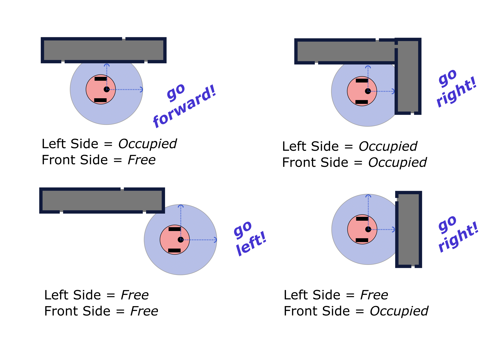
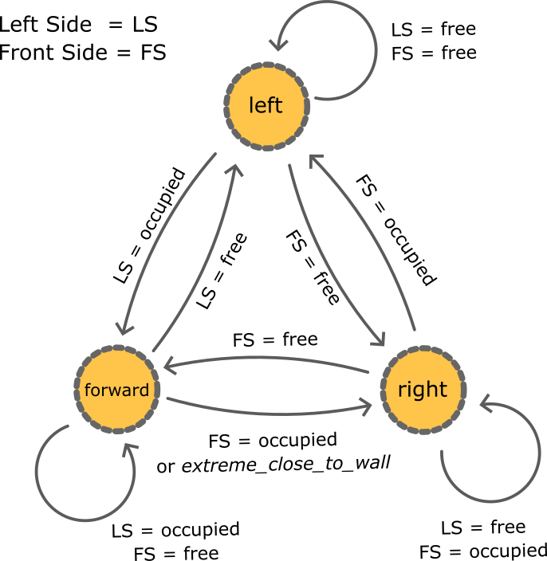

Lab 7: Wall Following and the Finite-State Machine
====================

Overview
--------

In this lab, we will continue the development of the Turtlebot2 left wall-following behavior, by fully describing the navigation and sensing problem and the way of approaching it. Additionally, we will introduce the Finite State Machine (FSM) which will be integrated into the development of our behavior. 

The developed behavior will be evaluated and tested on the real Turtlebot2 on Week 10, in a real wall-following setting.

Left Wall-following Scenario
--------

To perform the left wall following initially, we have to consider the type of sensor modules that the robot will need. In general, there are many types of sensors that can indicate the existence of a wall around the robot, either with physical touch or by distance. In our case, we place a LiDAR sensor on the top of the Turtlebot2, which provides `360°` range measurements around it. For the left wall-following scenario, we can reduce the captured ranging measurements down to the `front` and `left` side of the robot. In many robots, an ultrasonic ranging sensor is used to provide distances of the front and left side of the robot, but in our case, the LiDAR can provide a range of distance measurements on the front left side of the robot.

The cases that a robot might experience during its exploration in a maze, by following left wall-following, are depicted below,



Initially, as can be seen from the image, every case can be modeled by using two parameters, the `Left Side` and the `Right Side` occupancy. Thus, the robot depending on the values of these two parameters can decide on the next action-move, which can be moving `forward`, `left`, or `right`. These cases can be represented also as the following lookup matrix,


- left_wall

.. list-table:: 
    :align: center
    :widths: 50 50 50
    :header-rows: 1

    * - Left Side
      - Front Side
      - Action
    * - Free
      - Free
      - Left
    * - Free
      - Occupied
      - Right 
    * - Occupied
      - Free
      - Forward
    * - Occupied
      - Occupied
      - Right


Finite-State Machine (FSM)
--------

A Finite-State Machine is a state automata that can formulate an algorithmic problem, which can be described by distinct states and transitions between them. Specifically, an FSM contains a finite number of states with an initial starting state, and at each moment only one state can be active in the machine. To have a transition between states, specific actions needed to occur (triggered) that also are described by the transition actions.



The left wall-following problem described above can be illustrated as a FSM, by using the robot actions as the states and the range measurements as the transition triggers. As the FSM is formed it can be integrated inside the motion planning ROS node, to perform left wall following. Notably, to achieve the robot's inclination towards the left wall while moving forward, an `extreme_close_to_wall` parameter is used, which can be enabled when the robot has the left wall less than `10cm` closer to its left side.

Files
--------

Install source files from the github repo

Get the main python executable `left_wall_following.py <https://github.com/UCR-Robotics/ee106/blob/Spring2024/scripts/left_wall_following.py>`_ and store it under src of `ee106s24`. Get the 2 launch files `launch_mycomplex.launch <https://github.com/UCR-Robotics/ee106/blob/Spring2024/launch/launch_mycomplex.launch>`_ and `launch_my_more_complex.launch <https://github.com/UCR-Robotics/ee106/blob/Spring2024/launch/launch_my_more_complex.launch>`_ and store them under your launch folder. Download the two new Gazebo worlds, namely `mycomplex.world <https://github.com/UCR-Robotics/ee106/blob/main/scripts/mycomplex.world>`_ and `my_more_complex.world <https://github.com/UCR-Robotics/ee106/blob/main/scripts/my_more_complex.world>`_ and place them inside the `worlds` folder of ``ee106s24``.

Launch Simulation and Working
--------

To launch the gazebo simulation with the Turtlebot2 and the custom world, launch it by

```
roslaunch ee106s24 launch_mycomplex.launch
```

This will launch the Gazebo Simulation, loaded with the mycomplex.world and spawns the Turtlebot2 at origin. You would have to write code in `left_wall_following.py`, to make the robot finish the course. The launch file already has the parameters for the goal position and trajectory_name.csv file saved. 

Submission
--------

#.  Group Submission (2-people) via Gradescope

#. Due time: 11:59pm, June 1, Sunday

#. Files to submit for complex world :
 
 - lab7_report.pdf (Please provide a report describing all the following steps and results experienced in both experiments.)
 - complex_trajectory.csv
 - more_complex_trajectory.csv (submit this only for more complex world task)

#. Grading rubric:

 + \+ 10% Download the two new Gazebo worlds, namely `mycomplex.world <https://github.com/UCR-Robotics/ee106/blob/main/scripts/mycomplex.world>`_ and `my_more_complex.world <https://github.com/UCR-Robotics/ee106/blob/main/scripts/my_more_complex.world>`_ and place them inside the `worlds` folder of ``ee106s24``. Update the launch file from lab 4 or lab 5 to load the new worlds, for each experiment. 
 + \+ 40% Fully integrate the FSM behavior in the Turtlebot2 motion planning behavior.
 + \+ 25% Demonstrate the left wall-following behavior on the `mycomplex.world`, provide comments about the robot behavior. The End position for mycomplex world is (-1,3). Your robot needs to stop at the End position. The below picture is not the exact world picture. It is just for illustration.
 
 .. image:: pics/complex_case.png
 :align: center

 + \+ 25% Demonstrate the left wall-following behavior on the `my_more_complex.world`, provide comments about the robot behavior. The End position for my_more_complex world is (8,5). Your robot needs to stop at the End position. The below picture is not the exact world picture. It is just for illustration.
 
 .. image:: pics/more_complex_case.png
 :align: center

 + \- 15% Penalty applies for each late day. 


Reading Materials
--------

Wikipedia `Finite-state Machines <https://en.wikipedia.org/wiki/Finite-state_machine>`_ 
